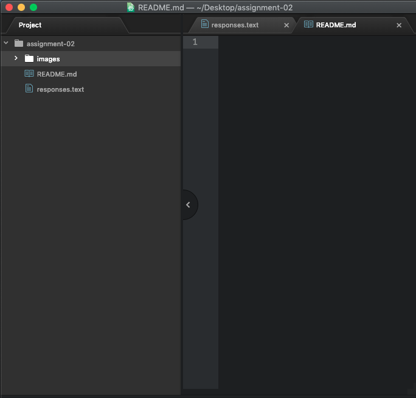

# Assignment-02
## Karah Durrin

I decided to take this class for multiple reasons. I needed the credit and it sounded like a good class. I also feel that it will a good skill to have, as well as a good resume booster.

List of 3 things I hope to learn:

- how to make a website
- the basics of the internet
- how to solve problems

[Amazon](https://www.amazon.com)

[My Responses File](./responses.txt)

